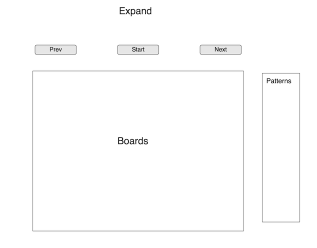

## Expand - An game of quick thinking

### Background and Overview

Expand fun interactive game has users use Conway's Game of Life nodes to take over a world... before its too late!

The Game of Life, also known simply as Life, is a cellular automaton devised by the British mathematician John Horton Conway in 1970.

Cells lifecycle is goverened by four principles, that govern whether or not an automoton will be "alive" in the next lifecyle based upon the "alive" status of its neighbor cells  

On each level, users are given patterns of cells which they may implement on any "visited" cell. Users must visit a certin number of spaces on the board before its too late!

### Functionality & MVP  

In Expand, users will be able to:

- [X] Select cell patterns to implement on the board
- [ ] See a active count of how many cells they have left to visit to pass the level
- [ ] See the set of cell patterns they are allowed to use on a given level
- [ ] Start and Restart the level
- [ ] Go to previous levels, or next level if level is completed
- [ ] Be able to mute game sounds

In addition, this project will include:

- [ ] An About modal describing the basic functionality
- [ ] A Details modal delving into the specific implementation of The Game of Life

### Wireframes

This app will consist of a single screen with the simulation canvas, playback controls, a list of available patterns, and nav links to the Github, my LinkedIn, and the About and Details about The Game of Life.  

The simulation canvas will include a dropdown for selecting the initial color of the creation object.

Playback controls along the top will include Start and Restart.

### Architecture and Technologies

This project will be implemented with the following technologies:

- Vanilla JavaScript for overall structure and game logic,
- `HTML5 Canvas` for DOM manipulation and rendering,
- Webpack to bundle and serve up the various scripts.

In addition to the webpack entry file, there will be four scripts involved in this project:

`board.js`: this script will handle the logic for creating and updating the necessary DOM elements.

`cell.js`: this script will house the physics logic for the cells.

`audio.js`: this script will handle the audio logic for when a user puts a cell pattern on the board.

### Implementation Timeline

**Day 1**: 
- [X] Research javascript implementations of The Game of Life
- [X] Set up Webpack
- [X] Get `webpack` serving files and frame out index.html, index.js

**Day 2**: Set up canvas element and get cells to behave correctly:
 
- [X] Start cell.js to handle logic of Game of Life cells
- [X] Get board to run with prepopulated cells
- [X] Make save "visited" squares

**Over the weekend**: Get the board to become clickable (add squares while board is running)

- [X] Make board clickable (add cell) while paused
- [X] Make board clickable (add cell) while running
- [ ] Build out collections
- [ ] Add walls to levels
- [ ] Add increased goal of visited to levels

**Day 3**: Let Player add collections to board while running. Goals for the day:

- [ ] Let player select from pool of collections
- [ ] Add desired collection to board while running
- [ ] Have a functional screen on the `Canvas` frontend that correctly handles creation and running of the simulation.
- [ ] Make sure that starting, and resetting works.

**Day 4**: Polish. Goals for the day:

- [ ] Add sound
- [ ] Add drop down modal explaning rules on load
- [ ] Have a styled `Canvas`, nice looking controls and title

### Bonus features

There are many directions in which this project could evolve.

- [ ] Add malicious cells
- [ ] Add diffrent types of cells that are either more resistant or multiply faster`
